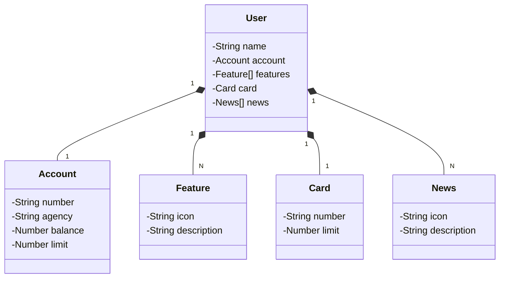

# Lab API REST

Este é um projeto laboratorial que demonstra a construção e a publicação de uma **API RESTful** na nuvem utilizando **Spring Boot 3**, **Java 17** e a plataforma **Railway**.

## Diagrama de Classes (Domínio da API)

